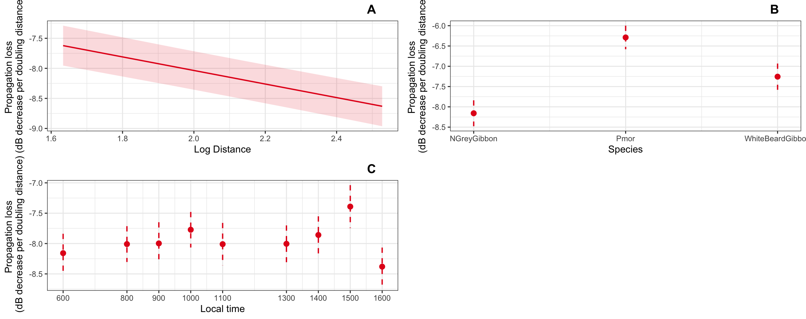

<!-- README.md is generated from README.Rmd. Please edit that file -->

# Propagation-loss-2023

Folders linked here:
<https://github.com/DenaJGibbon/Propagation-loss-2023/tree/main/R>
contain scripts for acoustic data processing and modeling.

Data for modeling is here:
<https://github.com/DenaJGibbon/Propagation-loss-2023/tree/main/dataformodeling>

Note that the data for modeling is further processed in the ‘modeling
scripts’ to calculate propagation loss.

Here are some preliminary results

<figure>

<figcaption aria-hidden="true">Maliau data.</figcaption>
</figure>

And here is some data from Rungan 
